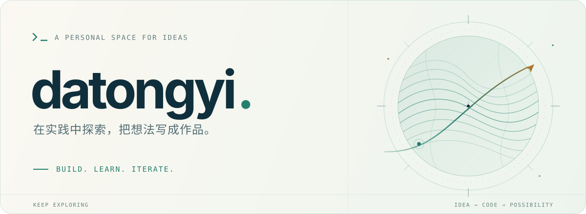
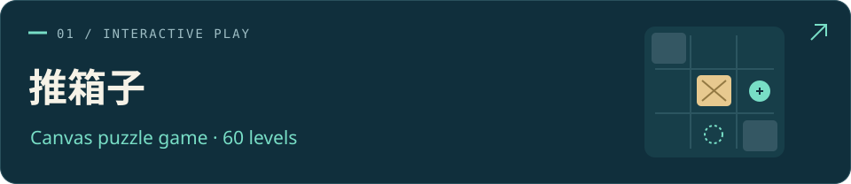
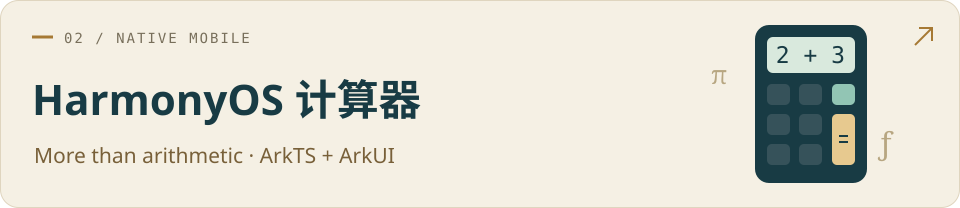
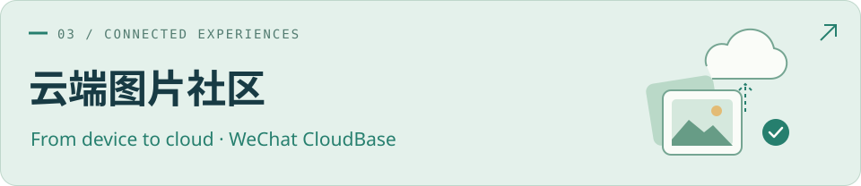

<picture>
  <source media="(prefers-color-scheme: dark)" srcset="./assets/hero-dark.svg" />
  <source media="(prefers-color-scheme: light)" srcset="./assets/hero-light.svg" />
  
</picture>

  <a href="#user-content-about">关于</a> &nbsp; / &nbsp;
  <a href="#user-content-projects">作品</a> &nbsp; / &nbsp;
  <a href="#user-content-toolkit">技术</a> &nbsp; / &nbsp;
  <a href="https://github.com/datongyi?tab=repositories">仓库 ↗</a>

## 你好，我是 datongyi 👋

这里记录我的移动开发实践：从微信小程序的页面与交互，到 Canvas 游戏、HarmonyOS 应用，再到云端图片分享。

我把学习过程写进代码，也把实现思路和遇到的问题留在项目文档里。希望每完成一个小作品，就多理解一点它背后的原理。

*Learning by building — mini programs, mobile apps, and small experiments.*

## 精选作品 · Selected work

下面三个作品来自我的 [《移动软件开发》课程仓库](https://github.com/datongyi/Mobile-Software-Development)，分别探索游戏逻辑、计算引擎和云端数据。

**把经典玩法，做成完整的小程序体验。** 60 个关卡，支持撤销、计时、进度保存和断点续玩；从地图与推动规则，到触摸交互和成绩评价。

`JavaScript` `Canvas` `微信小程序` `本地存储`

[查看源码与运行说明 →](https://github.com/datongyi/Mobile-Software-Development/tree/main/实验4：推箱子游戏)

 

**从一个表达式，到一套计算逻辑。** 基础、科学与单位换算三种模式，包含表达式解析、科学函数、记忆和历史；用 ArkUI 实现界面与主题切换。

`ArkTS` `ArkUI` `HarmonyOS` `表达式解析`

[查看源码与运行说明 →](https://github.com/datongyi/Mobile-Software-Development/tree/main/实验5：鸿蒙开发入门及计算器开发)

 

**让图片从本地走向云端。** 围绕发布、浏览和管理图片，串联云存储、云数据库与云函数，支持公共图片流、作者主页和图片详情。

`JavaScript` `微信云开发` `云函数` `云存储`

[查看源码与运行说明 →](https://github.com/datongyi/Mobile-Software-Development/tree/main/实验6：微信小程序云开发)

 

  
<b>继续探索：另外 3 个课程实验</b>

- [第一个微信小程序](https://github.com/datongyi/Mobile-Software-Development/tree/main/实验1：第一个微信小程序) — 数据绑定、输入事件与页面状态。
- [名片小程序](https://github.com/datongyi/Mobile-Software-Development/tree/main/实验2：名片小程序) — 主题切换、滑动标签与系统能力调用。
- [高校新闻网](https://github.com/datongyi/Mobile-Software-Development/tree/main/实验3：高校新闻网) — 新闻浏览、分类搜索、收藏和阅读历史。

## 技术足迹 · Toolkit

在这些项目中实际用到的语言、平台与工具：

**页面与交互** &nbsp; `JavaScript` `WXML` `WXSS` `Canvas` 
**鸿蒙应用** &nbsp; `ArkTS` `ArkUI` `HarmonyOS` 
**数据与工程** &nbsp; `微信云开发` `Node.js 测试` `Git` `Markdown`

从界面、状态和本地存储出发，继续探索计算逻辑、自动化测试与云端协作。

---

  <b>保持好奇，继续动手。</b> 
  Thanks for stopping by. See you in the next commit.

  <a href="https://github.com/datongyi/Mobile-Software-Development">探索课程作品 ↗</a>

