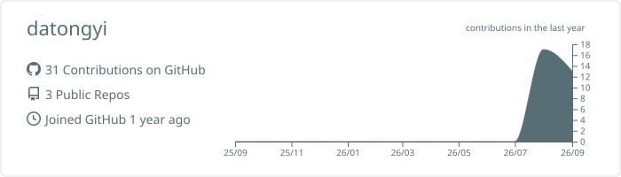
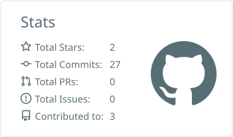
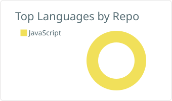
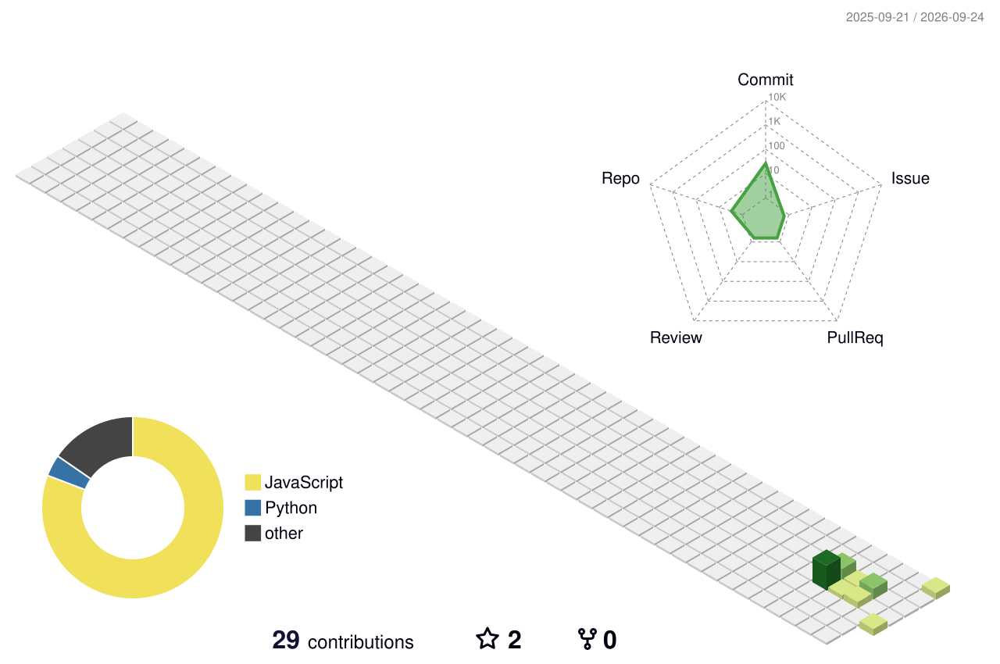
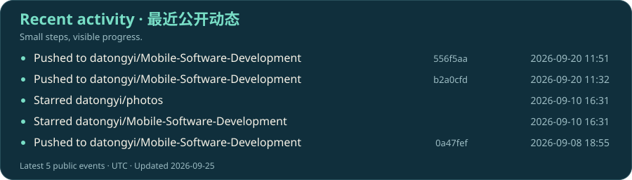

<picture>
  <source media="(prefers-color-scheme: dark)" srcset="./assets/hero-dark.svg" />
  <source media="(prefers-color-scheme: light)" srcset="./assets/hero-light.svg" />
  
</picture>

  <picture>
    <source media="(prefers-color-scheme: dark)" srcset="https://readme-typing-svg.demolab.com?font=Fira+Code&amp;weight=500&amp;size=22&amp;pause=1200&amp;color=78DEC6&amp;center=true&amp;vCenter=true&amp;width=720&amp;height=55&amp;lines=Hello%2C+I%27m+datongyi.;Mini+Programs.+HarmonyOS.+CloudBase.;Learning+by+building.+One+commit+at+a+time." />
    
  </picture>

  
  
  
  
  

  <a href="#user-content-about">关于</a> &nbsp; / &nbsp;
  <a href="#user-content-projects">作品</a> &nbsp; / &nbsp;
  <a href="#user-content-activity">动态</a> &nbsp; / &nbsp;
  <a href="https://github.com/datongyi?tab=repositories">仓库 ↗</a>

## 你好，我是 datongyi 👋

这里记录我的移动开发实践：从微信小程序的页面与交互，到 Canvas 游戏、HarmonyOS 应用，再到云端图片分享。

我把学习过程写进代码，也把实现思路和遇到的问题留在项目文档里。希望每完成一个小作品，就多理解一点它背后的原理。

*Learning by building — mini programs, mobile apps, and small experiments.*

## 🧰 技术足迹 · Toolkit

  <a href="https://skillicons.dev">
    <picture>
      <source media="(prefers-color-scheme: dark)" srcset="https://skillicons.dev/icons?i=js,nodejs,git,github,md&amp;theme=dark" />
      
    </picture>
  </a>

  
  
  

**页面与交互** · 数据绑定、页面状态、Canvas 绘制与触摸交互。 
**逻辑与数据** · 游戏规则、表达式解析、本地存储与云端图片服务。 
**工程实践** · Git 版本管理、Markdown 文档、Node.js 与 Hypium 测试。

## 📊 GitHub 一览 · By the numbers

<picture>
  <source media="(prefers-color-scheme: dark)" srcset="./profile-summary-card-output/github_dark/0-profile-details.svg" />
  
</picture>

  <picture>
    <source media="(prefers-color-scheme: dark)" srcset="./profile-summary-card-output/github_dark/3-stats.svg" />
    
  </picture>
  <picture>
    <source media="(prefers-color-scheme: dark)" srcset="./profile-summary-card-output/github_dark/1-repos-per-language.svg" />
    
  </picture>

## 精选作品 · Selected work

下面三个作品来自我的 [《移动软件开发》课程仓库](https://github.com/datongyi/Mobile-Software-Development)，分别探索游戏逻辑、计算引擎和云端数据。

**把经典玩法，做成完整的小程序体验。** 60 个关卡，支持撤销、计时、进度保存和断点续玩；从地图与推动规则，到触摸交互和成绩评价。

`JavaScript` `Canvas` `微信小程序` `本地存储`

[查看源码与运行说明 →](https://github.com/datongyi/Mobile-Software-Development/tree/main/实验4：推箱子游戏)

 

**从一个表达式，到一套计算逻辑。** 基础、科学与单位换算三种模式，包含表达式解析、科学函数、记忆和历史；用 ArkUI 实现界面与主题切换。

`ArkTS` `ArkUI` `HarmonyOS` `表达式解析`

[查看源码与运行说明 →](https://github.com/datongyi/Mobile-Software-Development/tree/main/实验5：鸿蒙开发入门及计算器开发)

 

**让图片从本地走向云端。** 围绕发布、浏览和管理图片，串联云存储、云数据库与云函数，支持公共图片流、作者主页和图片详情。

`JavaScript` `微信云开发` `云函数` `云存储`

[查看源码与运行说明 →](https://github.com/datongyi/Mobile-Software-Development/tree/main/实验6：微信小程序云开发)

 

  
<b>继续探索：另外 3 个课程实验</b>

- [第一个微信小程序](https://github.com/datongyi/Mobile-Software-Development/tree/main/实验1：第一个微信小程序) — 数据绑定、输入事件与页面状态。
- [名片小程序](https://github.com/datongyi/Mobile-Software-Development/tree/main/实验2：名片小程序) — 主题切换、滑动标签与系统能力调用。
- [高校新闻网](https://github.com/datongyi/Mobile-Software-Development/tree/main/实验3：高校新闻网) — 新闻浏览、分类搜索、收藏和阅读历史。

## 🐍 让贡献动起来 · Contribution snake

<picture>
  <source media="(prefers-color-scheme: dark)" srcset="./assets/contributions/github-snake-dark.svg" />
  
</picture>

## 🌏 代码的另一种地形 · 3D contributions

<picture>
  <source media="(prefers-color-scheme: dark)" srcset="./profile-3d-contrib/profile-night-rainbow.svg" />
  
</picture>

## ⚡ 最近在做什么 · Recent activity

统计与贡献图每日更新 · 访客计数从启用时开始累计

---

  <b>保持好奇，继续动手。</b> 
  Thanks for stopping by. See you in the next commit.

  <a href="https://github.com/datongyi/Mobile-Software-Development">探索课程作品 ↗</a>

