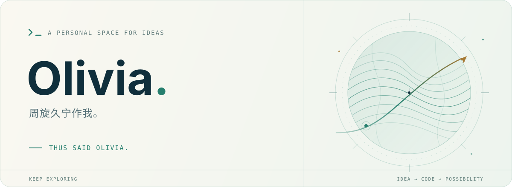
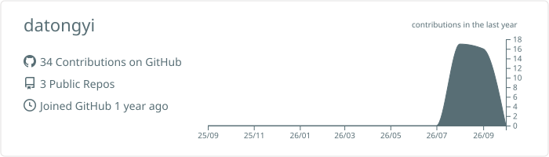
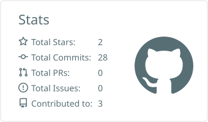
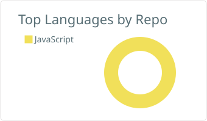
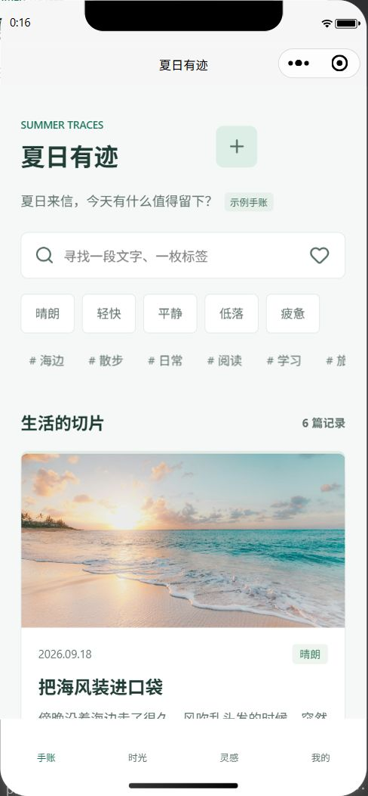
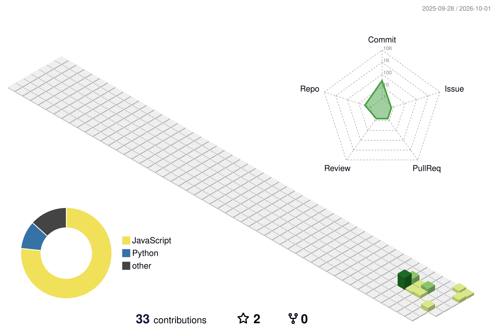
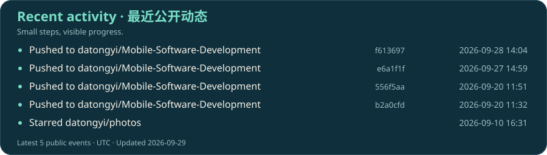

<picture>
  <source media="(prefers-color-scheme: dark)" srcset="./assets/hero-dark.svg" />
  <source media="(prefers-color-scheme: light)" srcset="./assets/hero-light.svg" />
  
</picture>

  <picture>
    <source media="(prefers-color-scheme: dark)" srcset="https://readme-typing-svg.demolab.com?font=Fira+Code&amp;weight=500&amp;size=22&amp;pause=1200&amp;color=78DEC6&amp;center=true&amp;vCenter=true&amp;width=720&amp;height=55&amp;lines=Hi+there%2C+I%27m+Olivia.;Thus+said+Olivia.;%E5%91%A8%E6%97%8B%E4%B9%85%E5%AE%81%E4%BD%9C%E6%88%91" />
    
  </picture>

  
  
  
  
  

  <a href="#user-content-about">关于</a> &nbsp; / &nbsp;
  <a href="#user-content-projects">作品</a> &nbsp; / &nbsp;
  <a href="#user-content-activity">动态</a> &nbsp; / &nbsp;
  <a href="https://github.com/datongyi?tab=repositories">仓库 ↗</a>

## Hi there, I'm Olivia 👋

**中文** · 我是一名正在学习的开发者，目前就读于中国海洋大学，专注于 C++、Python、Agent 架构构建。我喜欢思考各种存在背后的意义，并试图将韬虚落实。

- **当前方向**：Agent 工作流构建、完善与实现
- **持续探索**：人与 AI 的平衡，工程实现与沉潜学习的公共解
- **工作方式**：快速构建、真实验证、持续迭代
- **偏好项目**：解决具体问题、能真正交付和使用的工具

English

I'm a developer learning at Ocean University of China, focusing on C++, Python, and Agent architecture. I enjoy thinking about the meaning behind things and trying to put thoughtful restraint into practice.

- **Current focus**: Building, refining, and implementing Agent workflows
- **Ongoing exploration**: A shared balance between people and AI, engineering practice, and patient learning
- **How I work**: Build quickly, verify in real conditions, iterate continuously
- **Projects I value**: Tools that solve concrete problems and can truly be delivered and used

## 🧰 技术栈 · Tech stack

  
  
  
  
  
  

## 📊 GitHub 一览 · By the numbers

<picture>
  <source media="(prefers-color-scheme: dark)" srcset="./profile-summary-card-output/github_dark/0-profile-details.svg" />
  
</picture>

  <picture>
    <source media="(prefers-color-scheme: dark)" srcset="./profile-summary-card-output/github_dark/3-stats.svg" />
    
  </picture>
  <picture>
    <source media="(prefers-color-scheme: dark)" srcset="./profile-summary-card-output/github_dark/1-repos-per-language.svg" />
    
  </picture>

## 精选作品 · Selected work

目前展示 [《移动软件开发》课程仓库](https://github.com/datongyi/Mobile-Software-Development) 中的一个项目。

**夏日有迹** · 一个记录夏日体验的微信小程序，围绕记录、回顾与 AI 辅助功能展开。

`微信小程序` `WXML/WXSS` `JavaScript` `Agent 工作流`

[查看源码与运行说明 →](https://github.com/datongyi/Mobile-Software-Development/tree/main/夏日有迹)

## 🐍 让贡献动起来 · Contribution snake

<picture>
  <source media="(prefers-color-scheme: dark)" srcset="./assets/contributions/github-snake-dark.svg" />
  
</picture>

## 🌏 代码的另一种地形 · 3D contributions

<picture>
  <source media="(prefers-color-scheme: dark)" srcset="./profile-3d-contrib/profile-night-rainbow.svg" />
  
</picture>

## ⚡ 最近在做什么 · Recent activity

统计与贡献图每日更新 · 访客计数从启用时开始累计

---

  <b>周旋久宁作我。</b> 
  Thus said Olivia.

  <a href="https://github.com/datongyi/Mobile-Software-Development/tree/main/夏日有迹">探索夏日有迹 ↗</a>

